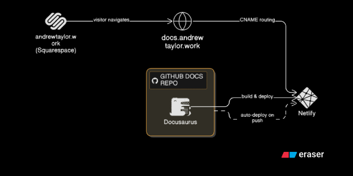

This blog post marks the start of my portfolio adventure. 

So far I've had a lot of fun getting [my website](https://andrewtaylor.work) set up. 

{/* truncate */}

I decided to use Squarespace to host my main website, where you can learn a little about me. I then used Docusaurus as my static website generator, which is connected to a GitHub repo for this site. Last, I decided to use Netlify to host the Docusaurus site and I setup a CNAME entry in Squarespace so that the redirect from docs.andrewtaylor.work takes viewers to Netlify:

I intend to use this space to share my resume, my [ikigai](https://en.wikipedia.org/wiki/Ikigai), my musings on the ever-changing state of AI - of which I'm sure opinions will be ever-changing as well, and a portfolio of technical writing work. I intend to start by hand writing a documentation set, and then creating a product and using Claude AI to help me co-write documentation. I am also weighing the local LLM trends to build a third product using my own self-hosted hardware at home.

It's gonna get interesting. Stay tuned for more! 